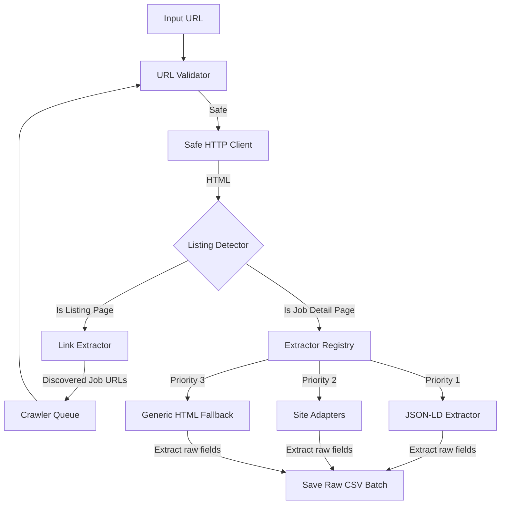

# Project Report: Academic Job-Advertisement Scraping & Analysis

This project serves as a research prototype built to study and compare technical-skill demands in the Sri Lankan and regional job markets. Originally built for [topjobs.lk](https://www.topjobs.lk), this tool has been updated to accept **any** job-posting website URL (whether a direct vacancy detail page OR a main job portal/search page), automatically discover and crawl IT-related job listings, filter non-IT roles dynamically, and clean/structure the extracted data.

---

## 1. Project Purpose & Scope

The primary objective of this project is to automate the collection and normalization of IT-related job posting data to study hiring trends and technical skill demands.

### Crawling Permissions and Ethics
* **Permission Status**: **Unverified**. Many job portals do not publish machine-readable `robots.txt` files or contain restrictive terms of use. Because our research involves downloading job posting details, the collection permission remains unverified, and large-scale scraping should not be performed without explicit authority.
* **Polite Scraping Delay**: A strict **2-second delay** is enforced between requests. It is important to note that a rate-limiting delay **does not** guarantee permission, grant access, or prevent IP blocking; it merely reduces server load as a best-practice politeness constraint.
* **Academic User-Agent**: We use a transparent Academic User-Agent identifying our purpose:
  `Academic Research Bot/1.0 (Contact: student-researcher@example.edu; Sri Lanka Skills Demand Study)`

### IT-Job Inclusion and Exclusion Scope
Because job categories can include generic and creative design roles, we apply inclusion and exclusion rules to select only valid IT-related jobs. These rules are configured in [it_keywords.txt](file:///Users/gavidurushela/Client%20Project/Research/config/it_keywords.txt):
* **Included Roles**: Software Engineering (Frontend, Backend, Full Stack, Mobile), QA & Software Testing, DevOps & Cloud Engineering, Data Engineering & Data Science, AI & Machine Learning, Cybersecurity, Database Engineering, Network & Systems Engineering, and IT Support.
* **Excluded Roles**: Graphic Designers, Multimedia/Creative Designers, Video Editors, 3D Animators/Artists, non-IT Machine Operators, Sales, Marketing, and generic Administrative Coordinators.
* **Ambiguous Roles**: Roles like general "Trainee", "Intern", "Associate", "Consultant", "Director", or "Manager" without explicit technical domains are flagged for manual review instead of being silently deleted.

---

## 2. Streamlit Dashboard & GUI Integration

A local Streamlit web application ([app.py](file:///Users/gavidurushela/Client%20Project/Research/app.py)) provides an interactive interface to execute, inspect, and analyze data:
* **Collect Data Tab**: Paste target vacancy URLs OR main job list URLs (any public, resolved URLs), run safety validations, toggle [urls.txt](file:///Users/gavidurushela/Client%20Project/Research/urls.txt) sync, and trigger the crawl. It handles dynamic queue expansion when listing pages are crawled and displays progress indicators.
* **Raw Data Tab**: Inspect the raw dataset, search positions, filter by company and extractor name, preview description HTML, and download CSV batches.
* **Clean Data Tab**: Call cleaning APIs, filter non-IT jobs, view pre-post cleaning stat comparisons (filtered records, deduplications), and download clean CSV datasets.
* **Quality Report Tab**: Verify schema columns, unique constraints, date formats, and download markdown quality reports.
* **Failure Logs Tab**: Inspect URL errors, non-IT exclusions, and image advertisements awaiting OCR.

---

## 3. Scraping & Extraction Architecture

The scraper uses a registry-based adapter architecture coupled with a dynamic link extractor:

### 1. Centralized URL Validator ([url_validator.py](file:///Users/gavidurushela/Client%20Project/Research/src/security/url_validator.py))
Protects against SSRF and target validation. Features:
* Blocks local/loopback/private IP addresses (including `localhost`, `127.0.0.1`, `::1`, `169.254.169.254`).
* Resolves hostnames dynamically to verify their IP addresses before connecting.
* Revalidates URLs dynamically when redirects are followed.
* Enforces standard ports (only HTTP 80 and HTTPS 443 are allowed).
* Rejects embedded credentials in URLs.
* Allows configuration of blocked domains via [blocked_domains.txt](file:///Users/gavidurushela/Client%20Project/Research/config/blocked_domains.txt).

### 2. Link Extractor ([link_extractor.py](file:///Users/gavidurushela/Client%20Project/Research/src/scraping/link_extractor.py))
Runs heuristics to discover individual job postings from listing indexes:
* Resolves relative paths to absolute URLs.
* Excludes external hostnames to prevent broad crawler leaks.
* Ignores static assets (`.pdf`, `.png`, etc.) and system routes (`/login`, `/signup`).
* Utilizes path and query parameter heuristics (`/job/`, `/vacancy/`, `jc=`, etc.) to locate detail pages.
* Capping limits are applied (polite limit of 30 requests per crawl) to prevent site overload.

### 3. Extractor Registry ([extractor_registry.py](file:///Users/gavidurushela/Client%20Project/Research/src/scraping/extractor_registry.py))
Dispatches details pages to the best matching parser:
1. **JSON-LD Extractor ([jsonld.py](file:///Users/gavidurushela/Client%20Project/Research/src/scraping/extractors/jsonld.py))**: Parses Schema.org `JobPosting` metadata blocks.
2. **Site-Specific Adapters**: Dedicated parsers for specific layouts, such as [topjobs.py](file:///Users/gavidurushela/Client%20Project/Research/src/scraping/extractors/topjobs.py).
3. **Generic HTML Extractor ([generic_html.py](file:///Users/gavidurushela/Client%20Project/Research/src/scraping/extractors/generic_html.py))**: Fallback parser using metadata tags (Open Graph, standard meta tags) and semantic HTML tags.

---

## 4. Data Tier Distinctions

The pipeline separates data into distinct tiers:
1. **Raw Source Data**: Unmodified raw parameters extracted directly from the web pages (including HTML markups and raw whitespaces) containing 29 schema fields. Saved inside `./data/raw/batches/`.
2. **Cleaned Internal Dataset**: Normalization of HTML entities, whitespaces, standardized dates/locations, and IT job exclusions. Saved to `./data/processed/jobs_clean_internal.csv` (22 columns).
3. **Final Research Dataset**: Cleaned, valid IT jobs exported to `./data/processed/jobs_clean.csv` (10 columns) to match the team-required format.

---

## 5. Directory & File Breakdown

### Root Files
* **[app.py](file:///Users/gavidurushela/Client%20Project/Research/app.py)**: Web dashboard implementing inputs validation, progress tracking, and CSV downloading.
* **[About.md](file:///Users/gavidurushela/Client%20Project/Research/About.md)**: This report file. Explains the project purpose, architecture, and file structure.
* **[README.md](file:///Users/gavidurushela/Client%20Project/Research/README.md)**: Developer quick-start guide, environment activation, pipeline execution, validation, and manual-review instructions.
* **`requirements.txt`**: Lists python dependencies and frozen versions.
* **[urls.txt](file:///Users/gavidurushela/Client%20Project/Research/urls.txt)**: Input configuration file containing target detail links to scrape.

### Configuration (`./config/`)
* **`blocked_domains.txt`**: List of hostnames explicitly blocked from being crawled.
* **`approved_domains.txt`**: Research record of domains reviewed for compliance.
* **`it_keywords.txt`**: List of keywords used to classify IT relevance.

### Source Code (`./src/`)
* **`security/url_validator.py`**: Centralized URL security module (SSRF, credentials, ports, DNS validation).
* **`scraping/models.py`**: Data structures representing raw extraction results (29 fields) and team exports.
* **`scraping/http_client.py`**: Safe HTTP client handling redirects, timeouts, size limits, and user-agents.
* **`scraping/link_extractor.py`**: Heuristics parser to identify vacancy detail pages inside indexes.
* **`scraping/service.py`**: Collection service orchestrating validation, fetch, extraction, and manifest recording.
* **`scraping/extractor_registry.py`**: Registry directing content to JSON-LD, Adapters, or Generic HTML extractors.
* **`cleaning/it_classifier.py`**: Parses classification rules dynamically from `it_keywords.txt`.
* **`cleaning/clean_jobs.py`**: Normalization, IT filtering, and deduplication script.
* **`cleaning/validate_jobs.py`**: Quality assurance validation and markdown report generator.
* **`test_app.py`**: Main regression unit tests for the scraper pipeline.

### Unit Tests (`./tests/`)
* **`test_url_validator.py`**: Validation checks for SSRF, ports, schemes, and hostnames.
* **`test_link_extractor.py`**: Heuristics verification and link scraping validations.
* **`test_it_classifier.py`**: Evaluates title relevance categorization and override handling.
* **`test_extractors.py`**: Extractor parsing logic and priority registry tests.
* **`test_cleaning.py`**: Cleaning and schema standardization tests.
